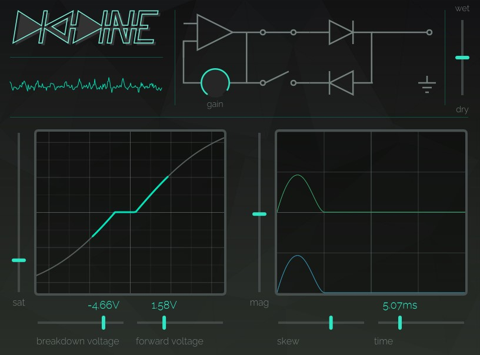

# a physically-inspired distortion VST.

===

Diodine is my first foray into the world of audio programming. It's a distortion effect designed to mimic real-life diode behavior, albeit with some big exaggerations.

The plugin has two stages - a waveshaping stage and a reverse recovery stage.

The waveshaper handles ideal(ish) diode behavior. Voltages below the forward voltage and above the breakdown voltage are blocked entirely, while voltages greater than those thresholds are allowed to pass through. The waveshaper additionally has a hyperbolic tangent saturation curve before the rectification, to help combat the loss in volume caused by the diodes' voltage drop. Forward voltage, breakdown voltage, saturation tension, pre/post gain, and mix are all controllable. The user can additionally interact directly with the circuit diagram to enable or disable the forward and backward diodes.

The second stage of the plugin is inspired by a lesser known behavior of diodes: reverse recovery. When a diode is forward biased, charge builds up on the diode junction. This charge opposes the junction's natural voltage - equal to the forward voltage - which is what allows more charge to flow across the diode. However, when the diode is reverse biased, this charge has to go somewhere. The effect is a short, but large spike of _negative_ current.

This is where Diodine begins to deviate from reality. Some of the exaggerations, approximations, and flat out creative decisions made are outlined below:
- Reverse recovery usually takes between several hundred nanoseconds and several milliseconds, depending on diode design. Diodine allows a reverse recovery of up to 20 milliseconds.
- Reverse recovery time, reverse current magnitude, and forward voltage are all closely related in real diodes. Changing one of these parameters in Diodine does not affect the others.
- Diodine "reverse recovery" is simply a large, negative spike added to the output "voltage" (sample magnitude). This is more or less entirely wrong, but it sounds cool, so I ran with it.

The end result is a distortion which is gritty, glitchy, and has a "choking" effect on the sound. Here's a simple pluck melody with Diodine on it:

<audio controls src="/projects/diodine/diodine_arp.wav"></audio>

You can check out the Diodine github [here](http://github.com/pwmagro/diodine). As a disclaimer, since this plugin was effectively a self-teaching tool, the code is not... pretty. I may revisit at a later date to clean things up and add some documentation.