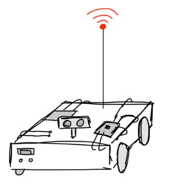

# autonomous signal-strength measuring robot

===

Simple Assessment of Signal Strength and Yield (SASSY) is a lightweight mobile platform which automatically navigates throughout and maps a room, sampling Wi-Fi signal data at regular intervals. This data is passed to a client
via HTTP and visualized in-browser as a heatmap. The heatmap displays relative signal strength integrity (RSSI) in dBa, and can be filtered by SSID or channel number. The tool can
additionally highlight the points in the map where the signal is strongest and weakest, allowing for more intelligent placement of repeaters and/or user device antennas.

This product is the result of a year-long capstone project at the University of Colorado Boulder. SASSY integrates custom hardware and software with off-the-shelf components
as a demonstration of the group's abilities to not only leverage technologies and techniques learned throughout the Electrical & Computer Engineering program, but also their
own research & problem-solving skills.

SASSY consists of the following major subsystems:
- Autonomous navigation algorithm, incl.:
	- Ultra-wideband (UWB) localization
	- Time-of-flight (ToF) distance measurement for obstacle avoidance
	- Motor encoders for stall detection
	- Motor control code
- Signal sensing
- Battery & power management
- On-board HTTP server

Because of my experience in embedded software, my role on the team was to manage software development. Using a modular & encompassed approach, I identified loosely coupled subsystems to allow development to be
parallelized & split among members of the team. I also took on development of the web server & site. As no members of the team had deep experience with web development - the website you're reading this on
was conveniently designed to use HTML & CSS with no Javascript, handing the nonstatic work off to the Grav CMS - a fair amount of research & experimentation was required.

The ESP32-C3 has limited resources, many of which are dedicated to the navigation algorithm. This meant that the user interface had to be nearly entirely client-side, with most work being done in Javascript.
Node.js was also not an option. The site contents also had to be very small. Our chip has 4 KB of flash total, so the site contents
had to be shared with location history & program code. YUI Minifier was used to compress Javascript and CSS. Because the website is only one page, these files were then manually moved into the `<head>`
of the index file, which was then minified using [Will Peavy's HTML Minifier](https://www.willpeavy.com/tools/minifier/).

The website uses HTTP POST requests to handle user input. There are buttons and fields for manual drive & system control as well as a command line interface. Buttons/field input is first translated into a
command, which is then parsed client-side before being sent to the ESP32. Parsing includes minimization to save bandwidth and microcontroller memory. Status updates are sent from the ESP32 to the client using
Websockets, which trigger command line messages and re-rendering of the heatmap.
